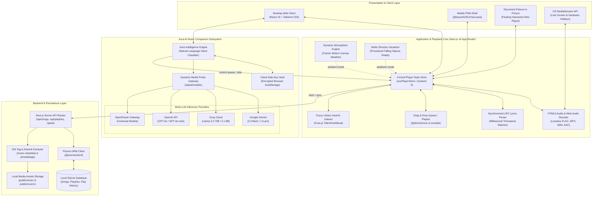

# 🎵 Stelify Music Player

<div align="center">

[](LICENSE)
[](https://nextjs.org)
[](https://react.dev)
[](https://www.typescriptlang.org/)
[](https://www.prisma.io)
[](https://tailwindcss.com)
[](https://web.dev/progressive-web-apps/)

<p align="center">
  <b>A high-fidelity Web Music Player and installable Progressive Web App (PWA) featuring audiophile lossless audio decoding, Document Picture-in-Picture (PiP), synchronized karaoke LRC lyrics, anime-inspired Waifu mode, and Aura — an autonomous AI music companion with dynamic atmosphere rendering.</b>
</p>

[Key Features](#-key-features) • [System Architecture](#-system-architecture) • [AI Companion (Aura)](#-ai-companion-room-aura) • [Keyboard Shortcuts](#-keyboard-shortcuts) • [API Reference](#-api-endpoints) • [Quick Start](#-quick-start) • [License](#-license)

</div>

---

## 📖 Overview

**Stelify Music Player** redefines the desktop and mobile browser listening experience. Combining audiophile audio playback standards with modern web capabilities, Stelify merges a lightning-fast **Next.js 16 App Router** frontend with a private local **SQLite + Prisma ORM** backend.

Whether you're listening to 24-bit/192kHz studio FLAC masters, singing along with millisecond-synced karaoke lyrics, multitasking with a detached floating **Document Picture-in-Picture** mini-player, relaxing in the animated **Shinobu Waifu Mode**, or commanding your library via natural voice/chat with **Aura AI**, Stelify delivers a fluid, responsive, and privacy-first audio haven.

---

## 🏗️ System Architecture



---

## ✨ Key Features

### 🎧 1. Audiophile Lossless Playback & Hardware MediaSession
- **Lossless Audio Pipeline**: Native browser Web Audio and HTML5 decoding supporting high-resolution FLAC (up to 24-bit / 192kHz), MP3 (320kbps CBR/VBR), WAV, AAC, and M4A containers without transcoding artifacts.
- **Hardware Media Controls**: Deep integration with the **W3C Media Session API**. Control playback, scrub position, skip tracks, and view high-resolution album art directly from your OS lock screen, Windows Action Center, macOS Control Center, or headset hardware keys.
- **Gapless Playlist Queue**: Zero-stutter track transitions managed by an in-memory Zustand queue with smart pre-buffering.

### 🖼️ 2. Dual-Mode Picture-in-Picture (PiP)
- **Desktop Document PiP API**: Leverages the cutting-edge `window.documentPictureInPicture` API on modern desktop browsers (Chrome, Edge) to spawn a genuine, interactive floating window containing live track info, spinning vinyl artwork, progress bar, volume controls, and playback buttons.
- **Mobile HTML5 Canvas Fallback**: Automatically falls back to an offscreen canvas video stream for mobile browsers, keeping track art and metadata floating over other applications.

### 🎤 3. Synchronized Karaoke LRC Lyrics
- **Millisecond Timestamp Matching**: Built-in parser (`parseLRC`) accurately translates `.lrc` timestamp tags (`[mm:ss.xx]`) into structured musical timecodes.
- **Frosted-Glass Active Tracking**: Center-focused smooth autoscroll keeps the currently sung line highlighted in real time without causing layout shifts or scroll stutter.
- **Interactive Click-to-Seek**: Tap any lyric line to jump the audio playback directly to that exact verse or guitar solo.

### 🤖 4. AI Companion Room ("Aura")
- **Universal Provider Auto-Detection**: Enter an API key from **Google Gemini**, **Groq**, **OpenRouter**, or **OpenAI**. Stelify automatically probes the provider endpoint, enumerates all accessible models (e.g. `gemini-2.0-flash`, `llama-3.3-70b-versatile`, `gpt-4o-mini`), and lets you switch on the fly.
- **Natural Language Library Control**: Talk to Aura just like a personal DJ:
  - *"Play some cheerful pop to boost my mood"*
  - *"Queue up my favorite anime soundtracks"*
  - *"Create a midnight playlist and change atmosphere to rain"*
- **Dynamic Atmosphere Canvas**: Real-time canvas backdrop dynamically changes based on the music's vibe:
  - 🌧️ **Rain**: Ultra-realistic stormy night with wind-swept raindrop streaks and dynamic thunderclouds.
  - 🌅 **Sunset**: Warm golden hour gradient with soft floating solar particles.
  - 🌌 **Midnight**: Deep cosmic space with twinkling star clusters and shifting nebulae.
  - 🎯 **Focus**: Minimalist calm glow for deep coding and study sessions.
- **Zero-Leak Client Privacy**: Custom API keys are stored solely in your browser's local `localStorage` and dispatched directly to local inference endpoints.

### 🌸 5. Waifu Mode (Shinobu Aesthetic Player)
- **Anime Visualizer Interface**: An aesthetic music player themed after Shinobu Kocho, featuring soft pastel accents, glassmorphic card containers, and ambient glows.
- **Particle Physics Simulation**: Interactive falling sakura petals dynamically sway and react to screen boundaries using customized CSS animation matrices.
- **Integrated Lyrics Tab**: Quick tab switcher (`[Song Info]` $\leftrightarrow$ `[Lyrics]`) lets you admire full cover art or follow the lyrics card without leaving the immersive view.

### 📑 6. Drag-and-Drop Library & Playlists
- **Intuitive Reordering**: Powered by `@dnd-kit/core` and `@dnd-kit/sortable` for silky 60fps drag-and-drop track reordering inside queue drawers and custom playlists.
- **Automatic ID3 Tag Extraction**: Uploading audio files triggers automatic metadata analysis via `music-metadata` and `jsmediatags`, extracting song title, artist, album, duration, bitrate, and embedded album art.
- **Listening History & Analytics**: Tracks playback frequency and timestamps in SQLite, powering personal statistics and smart recommendations.

### 📱 7. Installable Progressive Web App (PWA)
- Complete offline shell caching via `@ducanh2912/next-pwa` with custom Web App Manifest, splash screens, and desktop/mobile homescreen shortcuts.

---

## ⌨️ Keyboard Shortcuts

Control every aspect of playback without touching your mouse:

| Key | Action | Description |
| :--- | :--- | :--- |
| <kbd>Space</kbd> | **Play / Pause** | Toggle active playback |
| <kbd>→</kbd> | **Next Track** | Skip to the next song in queue |
| <kbd>←</kbd> | **Previous Track** | Return to previous track or start of current song |
| <kbd>↑</kbd> | **Volume Up** | Increase playback volume by 5% |
| <kbd>↓</kbd> | **Volume Down** | Decrease playback volume by 5% |
| <kbd>M</kbd> | **Mute / Unmute** | Instant audio mute with previous volume memory |
| <kbd>S</kbd> | **Shuffle** | Toggle random queue order |
| <kbd>R</kbd> | **Repeat** | Cycle repeat modes: `Off` → `All` → `One` |
| <kbd>F</kbd> | **Favorite** | Toggle like/favorite status on current track |
| <kbd>L</kbd> | **Lyrics** | Toggle synchronized karaoke lyrics overlay |
| <kbd>Q</kbd> | **Queue** | Open / close right slide-out play queue drawer |
| <kbd>P</kbd> | **Mini Player (PiP)** | Detach into floating Picture-in-Picture window |
| <kbd>Esc</kbd> | **Close / Dismiss** | Dismiss full-screen modals, drawers, or mobile player |

---

## 📡 API Endpoints

Stelify exposes a structured Next.js App Router REST API:

| Endpoint | Method | Description |
| :--- | :--- | :--- |
| `/api/songs` | `GET` | Fetch all songs with title, artist, album, cover, and mood tags |
| `/api/songs` | `POST` | Manually insert a song record into the database |
| `/api/songs/[id]` | `GET` | Get single song metadata and raw LRC lyrics string |
| `/api/songs/[id]` | `PUT` | Update song metadata, title, artist, album, or lyrics |
| `/api/songs/[id]` | `DELETE` | Remove a song record and clean up associated database relations |
| `/api/playlists` | `GET` | List all playlists with track counts and cover previews |
| `/api/playlists` | `POST` | Create a new playlist with optional description and cover |
| `/api/playlists/[id]` | `GET` | Get playlist details with complete ordered song list |
| `/api/playlists/[id]` | `PUT` | Update playlist title, description, or track ordering |
| `/api/playlists/[id]` | `DELETE` | Delete a playlist (preserves original song files) |
| `/api/favorites` | `GET` | Retrieve collection of all liked songs |
| `/api/favorites` | `POST` | Toggle favorite status for a given `songId` |
| `/api/upload` | `POST` | Multipart upload for audio files with automated ID3 tag extraction |
| `/api/ai` | `POST` | Aura AI companion chat, natural language queries, and library commands |
| `/api/ai/models` | `POST` | Probe and list available LLM models for a given API key & provider |
| `/api/analytics/record` | `POST` | Record playback event and increment track play counter |
| `/api/analytics/stats` | `GET` | Get aggregated listening statistics (top tracks, total time) |

---

## 🎼 Audio Format Compatibility

| Audio Container / Codec | File Extension | Bitrate / Quality | Decoding Method |
| :--- | :--- | :--- | :--- |
| **FLAC (Free Lossless Audio Codec)** | `.flac` | Up to 24-bit / 192 kHz | Native Web Audio / HTML5 Audio |
| **MPEG-1 Audio Layer III** | `.mp3` | Up to 320 kbps CBR / VBR | Native Browser Hardware Decoder |
| **Waveform Audio File Format** | `.wav` | 16-bit / 24-bit PCM Uncompressed | Native Web Audio PCM Decoder |
| **Advanced Audio Coding** | `.aac` | 64 kbps – 320 kbps | Native AAC Bitstream Decoder |
| **MPEG-4 Audio** | `.m4a` | AAC / ALAC encoded | Native MP4 Audio Container Parser |

---

## 🛠️ Tech Stack

| Domain | Technology | Version | Purpose |
| :--- | :--- | :--- | :--- |
| **Core Framework** | [Next.js](https://nextjs.org/) | `16.2.6` | App Router, Server Components, API routes |
| **UI Library** | [React](https://react.dev/) | `19.2.6` | Modern concurrent rendering, hooks, transitions |
| **Language** | [TypeScript](https://www.typescriptlang.org/) | `5.x` | Strict type safety across components and APIs |
| **Database ORM** | [Prisma](https://www.prisma.io/) | `6.19.0` | Schema migrations, SQLite client queries |
| **Database Engine** | [SQLite](https://www.sqlite.org/) | `3.x` | Zero-configuration local-first relational database |
| **Styling** | [Tailwind CSS](https://tailwindcss.com/) | `3.4.18` | Utility-first responsive styling and animations |
| **Motion & FX** | [Framer Motion](https://www.framer.com/motion/) | `12.23.26` | Fluid layout animations and particle effects |
| **State Management**| [Zustand](https://zustand-demo.pmnd.rs/) | `5.0.8` | Lightweight, decoupled global player state store |
| **Drag & Drop** | [@dnd-kit](https://dndkit.com/) | `6.3.1` | Accessible drag-and-drop playlist & queue sorting |
| **Fuzzy Search** | [Fuse.js](https://fusejs.io/) | `7.1.0` | In-browser fuzzy text search across metadata |
| **Metadata Parsing**| [music-metadata](https://github.com/Borewit/music-metadata) | `11.10.0` | Server-side ID3/Vorbis audio tag extraction |
| **Client ID3 Tags** | [jsmediatags](https://github.com/aadsm/jsmediatags) | `3.9.7` | Client-side tag and embedded artwork parsing |
| **AI Integration** | [Google Generative AI](https://ai.google.dev/) | `0.24.1` | Gemini Flash & Pro model orchestration |
| **LLM Gateway** | [OpenAI Node SDK](https://github.com/openai/openai-node) | `6.15.0` | Groq, OpenAI, and OpenRouter client connector |
| **PWA Service** | [@ducanh2912/next-pwa](https://github.com/DuCanhDe/next-pwa) | `10.2.9` | Service Worker registration and asset caching |

---

## 🚀 Quick Start

### Prerequisites
- **Node.js**: `v20.x` or `v22.x` (LTS recommended)
- **Package Manager**: `npm`, `pnpm`, or `yarn`

### 1. Clone the Repository
```bash
git clone https://github.com/stenlysayd/stelify-music-player.git
cd stelify-music-player
```

### 2. Install Dependencies
```bash
npm install
# or
pnpm install
```

### 3. Environment Configuration
Copy the example environment template:
```bash
cp .env.example .env.local
```
*(Optional: Configure your AI keys if you want server-wide defaults, or simply enter them inside the AI Room UI in your browser).*

### 4. Initialize Database Schema
Generate the Prisma Client and initialize your local SQLite database:
```bash
npx prisma db push
```

### 5. Run the Development Server
```bash
npm run dev
```
Open [http://localhost:3000](http://localhost:3000) in your web browser.

---

## 📦 Production & Deployment

### Production Build
```bash
npm run build
npm run start
```

### Running with PM2 (Background Daemon)
For continuous 24/7 background operation on a home lab, Linux server, or VPS:
```bash
npm install -g pm2
pm2 start npm --name "stelify-player" -- start
pm2 save
pm2 startup
```

---

## 📁 Directory Structure

```text
stelify-music-player/
├── app/
│   ├── ai-room/                # Aura AI companion, avatar visualizer, & Atmosphere canvas
│   │   ├── APIKeyModal.tsx     # Client-side multi-provider API key configuration modal
│   │   ├── Atmosphere.tsx      # Procedural weather canvas (rain, sunset, midnight, focus)
│   │   ├── Avatar.tsx          # Animated Aura 2D character avatar & soundwave visualizer
│   │   ├── Character.tsx       # Character state controller & expression rendering
│   │   ├── ChatPanel.tsx       # Interactive chat interface with conversation history
│   │   ├── page.tsx            # AI Companion room main view
│   │   └── useAICompanion.ts   # AI conversation state and library command parser
│   ├── api/                    # Next.js Server App Router API routes
│   │   ├── ai/                 # AI chat and natural language intent execution
│   │   │   └── models/         # Multi-provider model enumeration and validation
│   │   ├── analytics/          # Playback logging and listen count aggregation
│   │   ├── favorites/          # Liked tracks collection management
│   │   ├── playlists/          # Playlist CRUD and drag-and-drop track sorting
│   │   ├── songs/              # Audio library CRUD and metadata synchronization
│   │   └── upload/             # Multi-part audio and ID3 artwork upload handler
│   ├── components/             # Reusable UI component architecture
│   │   ├── AddToPlaylistModal  # Modal to assign songs into user playlists
│   │   ├── EditPlaylistModal   # Playlist rename and description editor
│   │   ├── EditSongModal       # Song metadata and LRC lyrics editor
│   │   ├── GlobalPlayer.tsx    # Audiophile persistent audio player with PiP & MediaSession
│   │   ├── LyricsOverlay.tsx   # Full-screen frosted-glass synchronized lyrics viewer
│   │   ├── LyricsView.tsx      # Compact tabbed lyrics component
│   │   ├── MiniPlayerContent   # Detached Document Picture-in-Picture window renderer
│   │   ├── QueueDrawer.tsx     # Slide-out sortable playback queue panel
│   │   ├── Sidebar.tsx         # Responsive navigation, library links, & volume controls
│   │   ├── SongContextMenu.tsx # Contextual right-click / three-dot action menu
│   │   └── SortableSongRow.tsx # Drag-and-drop sortable track list item (@dnd-kit)
│   ├── dashboard/              # Main library overview, search, and song collection
│   ├── favorites/              # Liked songs view
│   ├── playlist/               # Dynamic playlist detail and sequencing view
│   ├── upload/                 # Drag-and-drop audio & LRC file upload center
│   ├── waifu/                  # Shinobu Kocho aesthetic player mode with sakura petals
│   ├── globals.css             # Tailwind base styles and custom animation keyframes
│   └── layout.tsx              # Root HTML layout, Geist typography, & Zustand stores
├── lib/
│   ├── ai/                     # AI provider clients (Gemini, Groq, OpenAI, OpenRouter)
│   └── prisma.ts               # Prisma ORM singleton client instance
├── prisma/
│   └── schema.prisma           # SQLite relational database schema (Song, Playlist, History)
├── public/                     # Static icons, default covers, PWA icons & web manifest
├── .env.example                # Documented environment variables template
├── next.config.ts              # Next.js build configuration and PWA workbox settings
├── package.json                # Project dependencies and script declarations
├── tailwind.config.ts          # Custom Tailwind colors, fonts, and animation extensions
└── tsconfig.json               # Strict TypeScript compiler options
```

---

## 🔒 Privacy & Security

- **Zero-Telemetry Local Database**: The SQLite database (`dev.db`) resides entirely on your machine. Your library, listening history, and playlists never leave your environment.
- **Git-Protected Media Vault**: Uploaded audio tracks (`public/music/`) and cached album covers (`public/covers/`) are excluded via `.gitignore` to keep repositories light and copyright-compliant.
- **Client-Side Key Confidentiality**: All API keys entered in the AI Room modal are saved exclusively in browser `localStorage`. Keys are dispatched directly to inference endpoints and never transmitted to third-party telemetry services.

---

## 🤝 Contributing

Contributions, feedback, and pull requests are warmly welcome! If you'd like to improve features, add new visualizer themes, or optimize audio decoding:

1. Fork the repository (`https://github.com/stenlysayd/stelify-music-player`).
2. Create your feature branch (`git checkout -b feature/amazing-feature`).
3. Commit your changes (`git commit -m 'feat: add amazing new feature'`).
4. Push to the branch (`git push origin feature/amazing-feature`).
5. Open a Pull Request.

---

## 📄 License

Distributed under the **MIT License**. See [`LICENSE`](LICENSE) for more information.

---

<div align="center">

Crafted with 💜 by **[Stenly Sayd](https://github.com/stenlysayd)**

</div>
